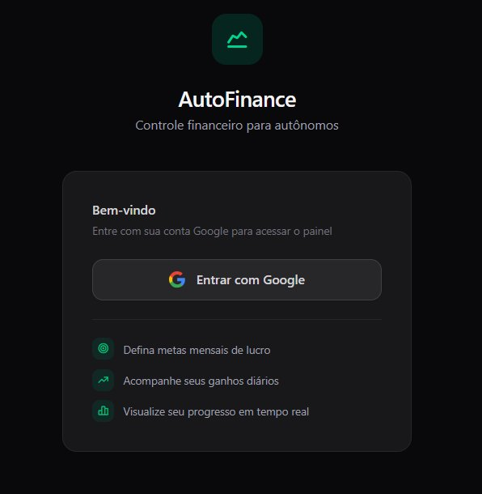
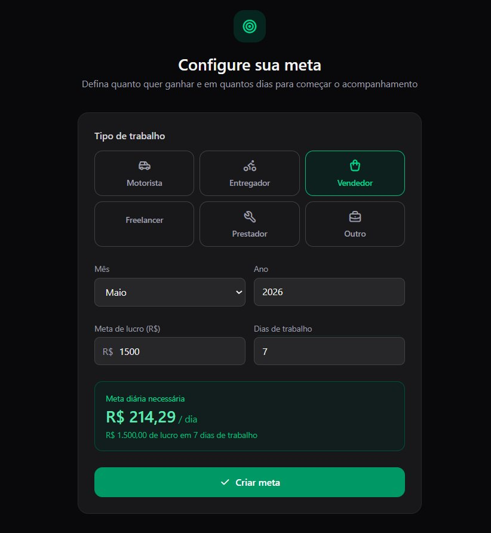
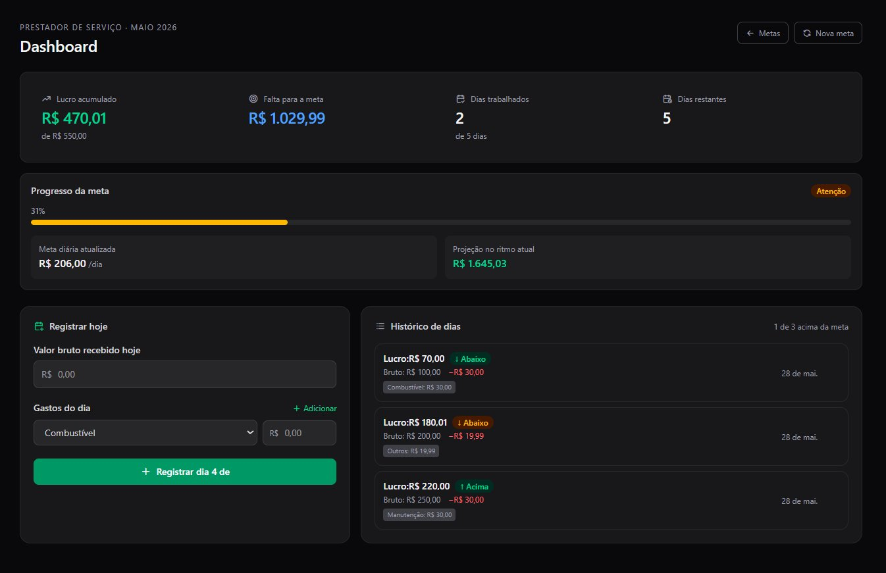
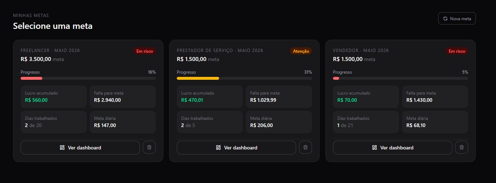

> Controle financeiro para trabalhadores autônomos.

🔗 **[Ver projeto em produção](https://projeto-controle-de-metas.vercel.app)**

---

## Sobre o projeto

A ideia é simples: você define quanto quer lucrar e em quantos dias pretende trabalhar. A cada dia, registra o valor bruto recebido e os gastos. O sistema calcula o lucro líquido, mostra seu progresso e recalcula automaticamente quanto você precisa fazer por dia para atingir a meta.

---

## Telas

  
  

 

  

 

  

---

## Funcionalidades

- Autenticação com Google via NextAuth.js
- Configuração de meta mensal por tipo de trabalho
- Cálculo automático da meta diária necessária
- Registro de ganhos e gastos por categoria (combustível, alimentação, manutenção, taxas de app)
- Dashboard com progresso em tempo real
- Recálculo dinâmico da meta diária conforme os dias passam
- Projeção de fechamento do mês no ritmo atual
- Histórico de dias com status visual (acima, na meta, abaixo)
- Gerenciamento de múltiplas metas simultâneas

---

## Stack

### Frontend
- **Next.js 15** — App Router com Server Components
- **TypeScript** — tipagem completa em todo o projeto
- **Tailwind CSS** — estilização utility-first
- **NextAuth.js** — autenticação com Google OAuth

### Backend
- **Node.js + Express** — estruturado em routes, controllers e services
- **TypeScript** — tipagem no backend também
- **Prisma ORM** — acesso ao banco com queries tipadas
- **JWT** — autenticação das rotas da API

### Banco de dados
- **PostgreSQL** hospedado no **Supabase**

### Deploy
- **Frontend** → Vercel
- **Backend** → Render

---
